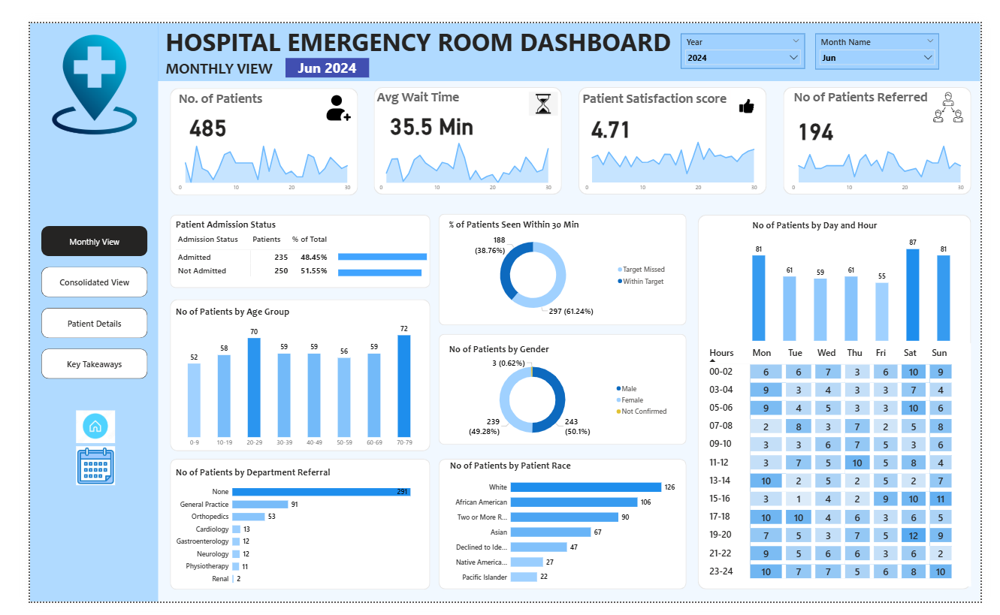
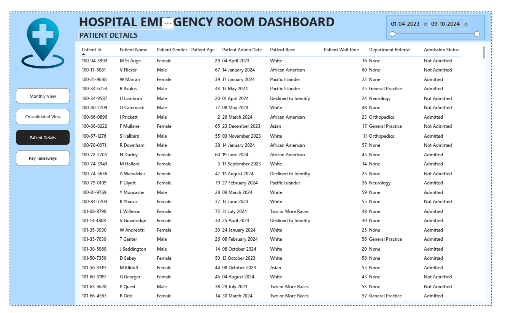
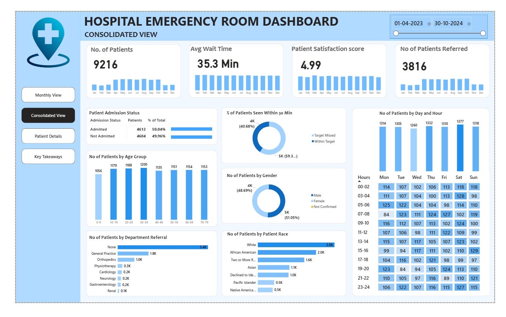

# 🏥 Hospital Emergency Room Dashboard – Power BI Project

📌 Project Overview
This project analyses hospital emergency room data to monitor operational efficiency, patient flow, and performance KPIs. The dashboard replaces manual reporting with interactive visual insights using Power BI.

## 🎯 Objectives
- Analyse patient admission trends
- Measure average wait time
- Monitor patient satisfaction score
- Track department referrals
- Evaluate admission vs non-admission cases

## 🛠️ Tools & Technologies Used
- Power BI
- Power Query
- DAX
- Excel Dataset
- Data Modelling (Star Schema)

DAX
Excel Dataset
Data Modelling (Star Schema)

📊 Key KPIs
Total Patients
Average Wait Time
Admission Rate
Patient Satisfaction Score
Department-wise Case Distribution

📈 Key Insights
Peak patient visits observed during specific time periods.
Certain departments receive higher emergency referrals.
Admission rate indicates a significant inpatient conversion.
Wait time directly impacts satisfaction scores.

📷 Dashboard Preview

👩‍💻 Author
Nobel Cathirine
Data Analyst | Power BI | SQL | Python

